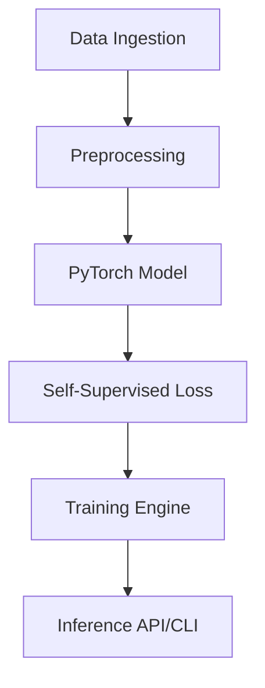

# LidarFlowSuite 🚗💨

**LidarFlowSuite** is a modular, production-grade tool for self-supervised LiDAR Scene Flow and motion segmentation.

## 🌟 Features

* **Self-Supervised Learning**: Predict 3D scene flow without expensive manual labeling.
* **Modular Architecture**: Clearly separated data loading, model definition, training loop, and API.
* **Multi-Dataset Support**: Full integration for KITTI Odometry and NuScenes datasets (supports multi-sweep).
* **Advanced self-supervised Losses**: Cycle-consistency and KNN-based smoothness losses.
* **Multi-Scale Prediction**: Hierarchical flow estimation for robust large-motion handling.
* **Benchmark Evaluation**: Formal evaluation pipeline with `EPE`, `Acc_Strict`, and `Acc_Relax` metrics.
* **3D Dashboard**: Interactive Streamlit-based visualizer.

## 🚀 Quick Start

### Installation

```bash
pip install -r requirements.txt
pip install -e .
```

### Basic Usage

#### Training

```bash
lidarflowsuite train --config configs/default_train.yaml
```

#### Evaluation

```bash
lidarflowsuite eval --dataset kitti --checkpoint checkpoints/latest.pth
```

#### Launch Dashboard

```bash
lidarflowsuite dashboard
```

## 📚 Tutorials

Check out our [interactive tutorials](file:///Users/ismailtasdelen/Documents/GitHub/LidarFlowSuite/tutorials/01_kitti_walkthrough.ipynb) to get started with the codebase.

## 🏗️ Architecture



## 📜 License
MIT
