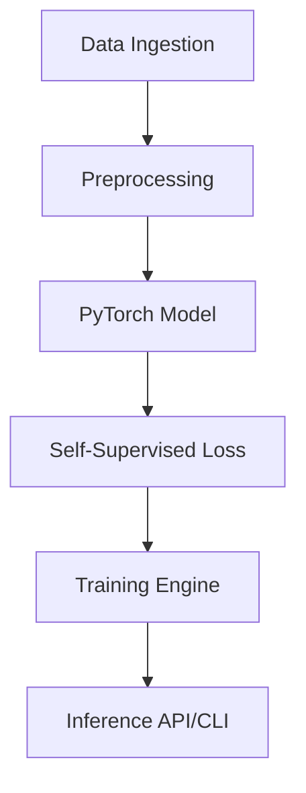

# LidarFlowSuite 🚗💨

**LidarFlowSuite** is a modular, production-grade tool for self-supervised LiDAR Scene Flow and motion segmentation.

## 🌟 Features

* **Self-Supervised Learning**: Predict 3D scene flow without expensive manual labeling.
* **Modular Architecture**: Clearly separated data loading, model definition, training loop, and API.
* **Multi-Dataset Support**: Built-in support for KITTI and NuScenes datasets.
* **Advanced Self-Supervised Losses**: Cycle-consistency and KNN-based smoothness losses for better motion estimation.
* **3D Dashboard**: Interactive Streamlit-based visualizer for point clouds and flow vectors.
* **Edge Optimization**: Scripts for ONNX export and quantization preparation.

## 🚀 Quick Start

### Installation

```bash
pip install -r requirements.txt
pip install -e .
```

### Basic Usage

#### Training

```bash
lidarflowsuite train --config configs/default_train.yaml
```

#### Launch Dashboard

```bash
lidarflowsuite dashboard
```

#### API Server

```bash
lidarflowsuite api
```

#### Export Model

```bash
python scripts/export.py --checkpoint checkpoints/latest.pth
```

## 🏗️ Architecture



## 📜 License
MIT
