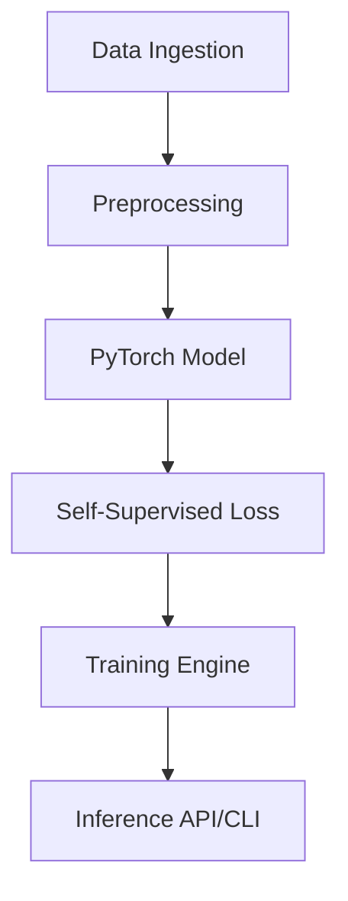

# LidarFlowSuite 🚗💨

**LidarFlowSuite** is a modular, production-grade tool for self-supervised LiDAR Scene Flow and motion segmentation.

## 🌟 Features

*   **Self-Supervised Learning**: Predict 3D scene flow without expensive manual labeling.
*   **Modular Architecture**: Clearly separated data loading, model definition, training loop, and API.
*   **Multi-Dataset Support**: Built-in support for KITTI and NuScenes datasets.
*   **Production Ready**: CLI for daily research tasks and FastAPI for remote inference deployments.
*   **Advanced Monitoring**: Built-in anomaly detection and comprehensive metric tracking.

## 🚀 Quick Start

### Installation

```bash
pip install -r requirements.txt
pip install -e .
```

### Basic Usage

#### Training
```bash
lidarflowsuite train --config configs/default_train.yaml
```

#### Inference CLI
```bash
lidarflowsuite predict --input samples/pcd_0.bin --checkpoint latest.pth
```

#### API Server
```bash
lidarflowsuite api
```

## 🏗️ Architecture



## 📜 License
MIT
